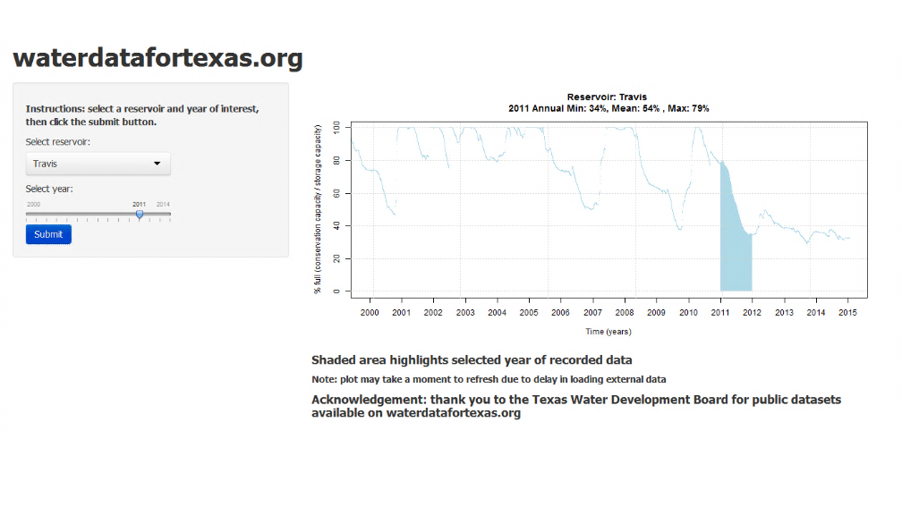

<style>
.title-slide {background-color: #0f5feF}

.title-slide hgroup h1 {
  font-size: 65px;
  line-height: 1.4;
  letter-spacing: -3px;
  color: #FFFFFF;
}


.title-slide hgroup h2 {
  font-size: 34px;
  color: #FFFFFFF;
  font-weight: inherit;
}


</style>


## Everything's bigger in Texas
###  including drought & flood 

<!--- 2-column example from http://rmarkdown.rstudio.com/ioslides_presentation_format.html --->

 <div class="columns-2">

<br>
  
 The state of Texas (USA) spans a large geographical area, with severe drought in western regions coinciding with a rainy season in the east.

<br> 

This figure shows the recent status of water reservoirs statewide as a percentage of filled capacity. 
<br> [Image credit:  Texas Water Development Board, waterdatafortexas.org]

 
   
 
 
</div>


For the course project, I developed a shiny application that illustrates changes in reservoir water levels through time. The app loads datasets for individual reservoirs  and calculates summary statistics for a selected year, and plots the highlighted year along with the historical record. 
<br>
 
 


---  .class #id

## Shiny app screenshot





---  .class #id


## Reservoir Stats


```{r, echo=FALSE, eval=TRUE}

# Example calculations 


# load data for TRAVIS  (user would select reservoir name in shiny app's pull-down menu)
reservoir_url <- paste("http://waterdatafortexas.org/reservoirs/individual/travis.csv")
reservoir_history <- read.csv(url(reservoir_url), comment.char="#",  header=TRUE, check.names=TRUE)
reservoir_history$date <- as.Date(reservoir_history$date, "%Y-%m-%d")

# select 2011 (user would select year with slider in shiny app )
user_year_start <- as.Date("2011-01-01", "%Y-%m-%d")
user_year_end <- user_year_start + 365


year_range_logical_index <- (reservoir_history$date >= user_year_start) & (reservoir_history$date <= user_year_end)
reservoir_selected_year <- reservoir_history[year_range_logical_index,]


# calculate summary stats
#  note: pct_full_mean calculation is only valid when comparing data from the same total capacity
#   In this case, the total conservation capacity for a selected reservoir is assumed to be constant through the selected year.

# Summary of 'fullness' as defined by (conservation capacity) / (storage capacity) during selected year.


```

```{r, echo=TRUE, eval=TRUE}
# Example calculations for summary statistics during selected year.
mean(reservoir_selected_year$percent_full)  
min(reservoir_selected_year$percent_full)
max(reservoir_selected_year$percent_full)
# Note: calculations valid when storage capacity is constant throughout selected year [generally true]

```

---  .class #id


## Acknowlegements
 
 <li> Texas Water Development Board (TWDB), waterdatafortexas.org  </li>
 <li> Developing Data Products discussion forums </li>
 <li> stackoverflow.com </li>
 
 
 
 


