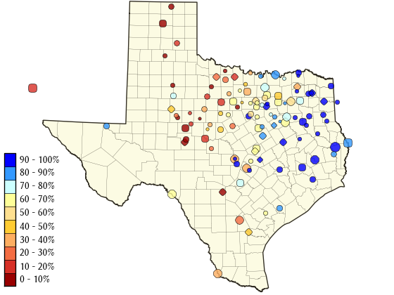

<style>
.title-slide {background-color: #88F}
</style>


## Everything's bigger in Texas
###  including drought & flood 

<!--- 2-column example from http://rmarkdown.rstudio.com/ioslides_presentation_format.html --->

 <div class="columns-2">

<br>
  
 The state of Texas (USA) spans a large geographical area, with severe drought in western regions coinciding with a rainy season in the east.

<br> <br> 

This figure shows the recent status of water reservoirs statewide as a percentage of filled capacity.
 
 
 
   
 
 
</div>


For the course project, I developed a shiny application that illustrates changes in reservoir water levels through time. The app loads datasets for individual reservoirs and calculates summary statistics for a selected year, and plots the highlighted year along with the historical record. 

 <sub><sub>         Image credit:  Texas Water Development Board, waterdatafortexas.org </sub></sub>


---  .class #id

## Shiny app screenshot


---  .class #id


## Reservoir Stats


```r
# Example calculations for summary statistics during selected year.
mean(reservoir_selected_year$percent_full)  
```

```
## [1] 54.33361
```

```r
min(reservoir_selected_year$percent_full)
```

```
## [1] 34.5
```

```r
max(reservoir_selected_year$percent_full)
```

```
## [1] 79.3
```

```r
# Note: calculations valid when storage capacity is constant throughout selected year [generally true]
```

---  .class #id


## Acknowlegements
 
<h3> Thank you </h3>
 
 <li> Texas Water Development Board (TWDB) for providing data sets on waterdatafortexas.org  </li>
 <li>  Staff and students for informative lectures and helpful discussion forums </li>
 <li>  R community on stackoverflow.com </li>
 
 
 
 


